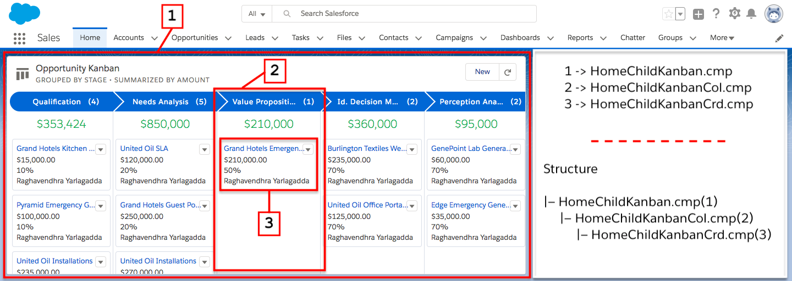

# Home/Child Kanban

Home/Child Kanban or if the / or space is a problem HomeChildKanban
This component is fully native and highly customizable Drag & Drop Kanban view that can be configured for any related lists and home pages enabling you to choose the object, group and summarize its key differentiators & its records' key information to be shown on the kanban tiles.

Once configured, this component shows the list of all records grouped by a picklist value, summarized by a numeric field, change the group by value with just a Drag & Drop, navigate to the records shown in the kanban view, edit & delete them effortlessly! 
All this with some cool animations.

AppExchange Listing:
https://appexchange.salesforce.com/appxListingDetail?listingId=a0N3A00000DmgtuUAB

---

### Component Structure
```
|- HomeChildKanban.cmp
    |- HomeChildKanbanCol.cmp
        |- HomeChildKanbanCrd.cmp
```


---

### Setup/Walkthrough Video
[](http://www.youtube.com/watch?v=h7VdchJal_o)
